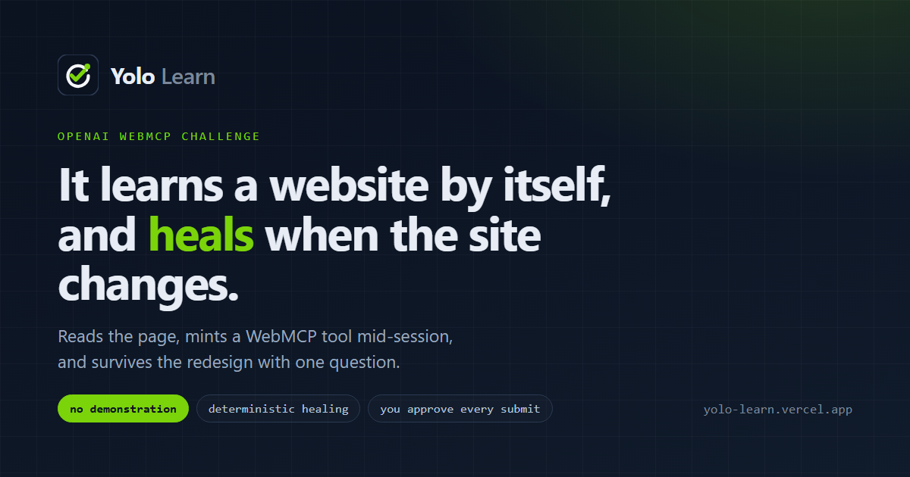
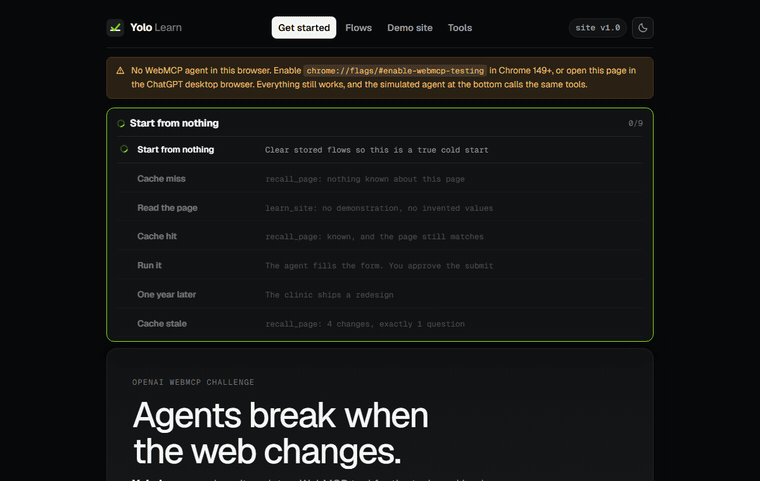
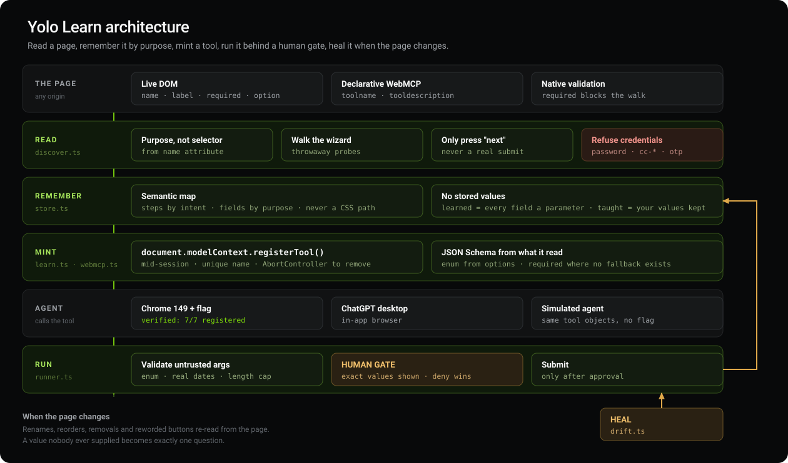

<p align="center">
  
</p>

<h1 align="center">Yolo Learn</h1>

<p align="center">
  Agents re-read every site from scratch, then break when the page moves.<br>
  This remembers the <em>task</em>, mints a WebMCP tool, and heals the memory.
</p>

<p align="center">
  <a href="https://yolo-learn.vercel.app"></a>
  
  
  
  
  
  
</p>

<p align="center">
  <a href="https://yolo-learn.vercel.app"><strong>Live demo</strong></a>
  ·
  <a href="#measured">Measured</a>
  ·
  <a href="#the-problem">The problem</a>
  ·
  <a href="#the-drift-taxonomy">Drift taxonomy</a>
  ·
  <a href="#webmcp">WebMCP</a>
</p>

---

<h3 align="center">No extension. No account. Open the URL.</h3>

<p align="center">
  Every comparable approach to making unfamiliar sites agent-ready ships a browser extension.<br>
  This is a web page. The only thing it cannot do without one is watch a tab it does not own.
</p>

## Measured

Not claims. Numbers, each reproducible from the live site.

| What | Result | How to check it |
| --- | --- | --- |
| **Re-reading a site it already knows** | **1230× faster**, 466KB to 0 | `learn_url` on Wikipedia twice; the second is served from memory |
| **Agreement with W3C on W3C's own pages** | **44 findings to 3.** High 8 to 0, medium 33 to 0 | Audit the WAI before/after pair; nobody here wrote either version |
| **Server-side fetch, SSRF surface** | **14 of 14 vectors blocked**, including `localhost` resolving to `::1` and the cloud metadata IP | `node ssrf-check.mjs` |
| **A run interrupted by a page teardown** | Resumes at the step it reached, approval gate intact | Start a run, hard-reload mid-flight |
| **Tests** | 328, including one that reproduces a real ChatGPT invocation crash | `npm test` |

Every number above is worked through in **[VERIFICATION.md](VERIFICATION.md)**,
including what is *not* verified. The ChatGPT session that found a real bug in
this code is transcribed in
**[docs/CHATGPT-SESSION.md](docs/CHATGPT-SESSION.md)**.

---

## The problem

People already know their own repetitive flows: book this clinic, renew this permit, order from this supplier. No vendor will ship an official agent tool for those pages. So today an agent **drives the DOM from zero on every visit**. That is slow, expensive, and it silently dies the first time someone renames a field.

This is not “a WebMCP feature.” WebMCP only does one thing well: `registerTool()` on a document, including **mid-session**. The product is the layer above that:

1. **Learn the task once** (read the page, or watch the human click through).
2. **Skip the re-read** on the next visit (`recall_page` / `recall_url`: no fetch if the shape is unchanged).
3. **Heal** when the shape did change, instead of throwing the memory away.

Same origin is required for a minted tool the agent can call. That is why the demo clinic lives here. A public URL you paste is fetched read-only (GET). No browser extension.

## Time on a revisit

| | First visit | Visit two, same task |
| --- | --- | --- |
| Agent scraping the page again | Full read | Full read again |
| Yolo Learn | Read once, store shape | **Cache hit. 0 bytes fetched** |

Keyed on origin + fingerprint of step intents and field purposes, not on headlines or CSS.

## Demo (video)

<p align="center">
  
</p>

<p align="center"><sub>Real tool calls, not a mock. You still approve each submit. For Devpost, upload this loop to YouTube (under 3 minutes, with audio).</sub></p>

[Just learned](https://yolo-learn.vercel.app/#/?demo=learned) · [Drifted](https://yolo-learn.vercel.app/#/?demo=drifted) · [Healed](https://yolo-learn.vercel.app/#/?demo=healed)

Still of the architecture (not a full-page screenshot):

<p align="center">
  
</p>

---

## The drift taxonomy

The core artifact. Twelve named ways a page can move, and for each one a single
decision: **does the repair come from the page, or from a human?**

One rule decides every row. *A change heals from the page when the new truth is
on the page. It needs a human only when it requires a value nobody has ever
supplied.* A rename heals because the new label is right there. A new required
field cannot, because no amount of reading tells you somebody's insurance
number. That is why the v2 redesign produces four changes and exactly one
question.

| Change | Repaired by | Why |
| --- | --- | --- |
| `RENAMED` | page | The new label is there; the purpose never moved |
| `REORDERED` | page | Order is read from the page; the task is unchanged |
| `WORDING` | page | New button text, and no stored value depends on it |
| `REMOVED_FIELD` · `REMOVED_STEP` | page | Nothing to supply for something that is gone |
| `NEW_STEP` | page | Its shape is readable; only required fields can ask |
| `ROUTE_CHANGED` | page | The new address is where the page was found |
| `TYPE_CHANGED` | page | A text box tightened into a dropdown is readable |
| `OPTIONS_CHANGED` | page\* | A longer list is readable |
| `REQUIRED_RELAXED` | page | Fewer obligations never needs an answer |
| `NEW_FIELD` | **human** | If required, the page cannot reveal what to type |
| `REQUIRED_ADDED` | **human** | An optional field left empty can now block the task |

\* `OPTIONS_CHANGED` is the one that escalates. If a list drops the value this
task relied on, the stored answer is no longer acceptable and filling it would
**submit an empty field with no error**. That is detected, and the question
names the withdrawn value and the alternatives rather than asking generically.

The registry lives in [`src/drift-taxonomy.ts`](src/drift-taxonomy.ts) with a
reason on every row, and a test asserts the detector cannot emit a type the
registry does not describe.

## WebMCP

Judges score **WebMCP Leverage** first: a working, non-trivial `registerTool` path they can read. That file is [`src/webmcp.ts`](src/webmcp.ts).

```ts
await document.modelContext.registerTool(
  {
    name: "clinic_booking",
    description: "...",
    inputSchema: { type: "object", properties, required },
    annotations: { readOnlyHint: false, untrustedContentHint: true },
    execute: async (args, { signal }) => { /* untrusted args, abort, human gate */ },
  },
  { signal: controller.signal }
)
```

What that file actually handles: `document` then `navigator` feature-detect; `registerTool` is a Promise and rejects `InvalidStateError` on duplicate names; unregister is aborting the signal; `Origin-Agent-Cluster: ?1` or Chrome returns `SecurityError`; execute must not crash when an implementation omits `signal`.

| Tool | Why it exists |
| --- | --- |
| `recall_page` / `recall_url` | Do I already know this? Call first. A hit is the time saving. |
| `learn_site` / `learn_url` | First visit. `pages` = URLs the user already opened by hand. |
| `learn_markup` | HTML from a tab the user already opened (including logged-in). Cookies stay there. |
| `remembered_<host>` | Minted mid-session after a public URL is learned. Call it instead of fetching. `refresh=true` re-reads. |
| `start_teaching` | Human fills the clinic; the app watches. |
| `run_flow` / minted name | Drive the task. Human owns irreversible steps. |
| `check_flow_health` / `heal_flow` | Redesign. At most one question. |
| `get_run_status` | The agent’s promise died on navigation. |
| `audit_page` / `audit_url` | Measure, cite a rule, do not guess. |

### Try it

Chrome 149+: `chrome://flags/#enable-webmcp-testing`, then [yolo-learn.vercel.app](https://yolo-learn.vercel.app). Ask: *Learn the clinic, then run it.* Or paste a public URL on the home page.

No flag: the simulated agent at the bottom calls the **same** registered objects.

---

## Clinic vs a URL you paste

**Northside Family Clinic stays.** Booking plus a real v2 redesign (rename, reorder, new required field, new button) is the heal loop. Inventing a different demo would throw that away.

**Your site:** paste a public URL, or capture a tab you already signed into (bookmarklet / `learn_markup`). Headless Chrome can run public JS. Sessions stay in your browser. Nothing is POSTed.

**Audit:** `#/audit` — W3C’s own before/after pages are the control.

---

## Run

```
npm install
npm run dev
```

`npm test` · `npm run typecheck` · `npm run build` · `npm run check:ssrf`

MIT · [Hotragn Pettugani](https://github.com/Hotragn)
