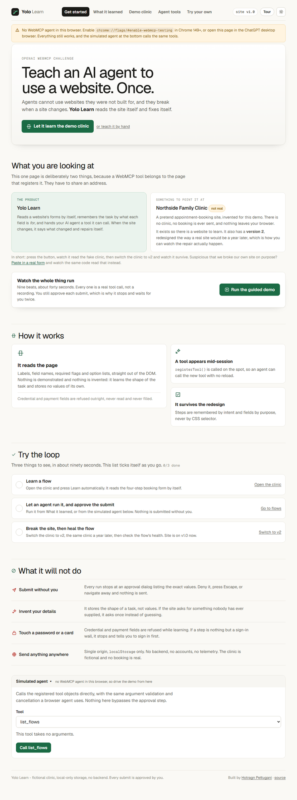
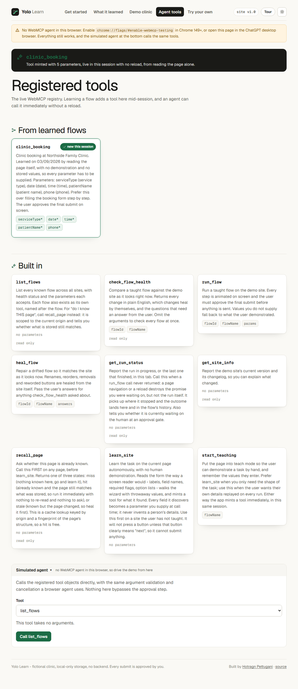
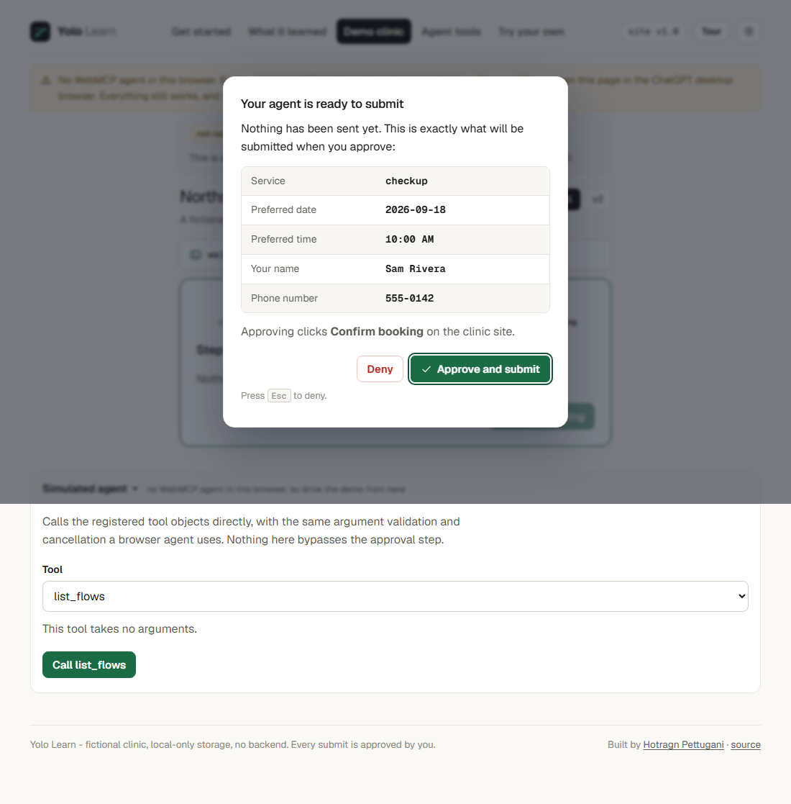
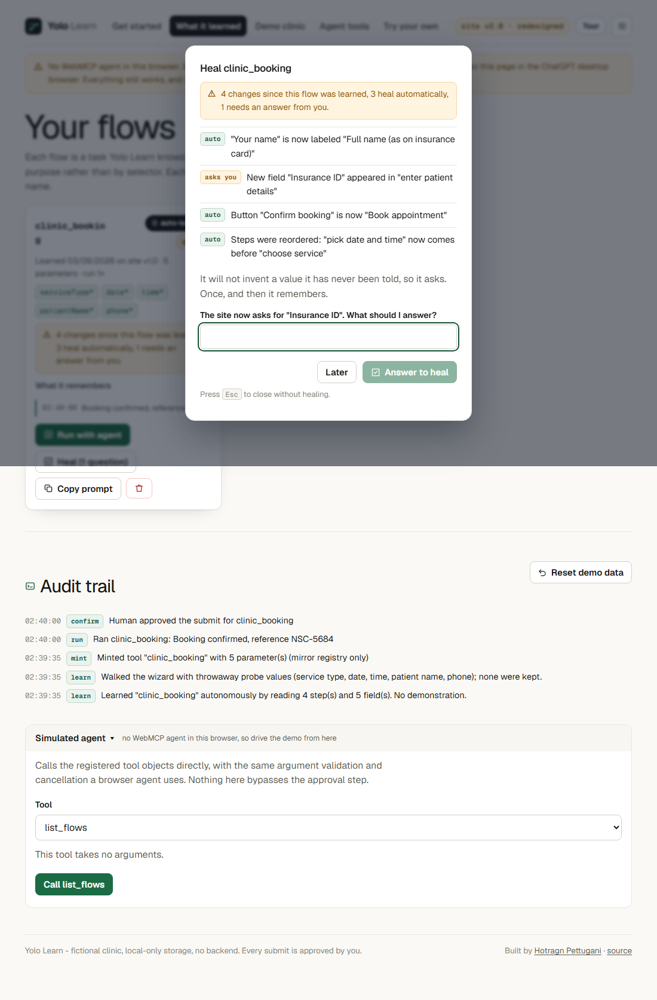
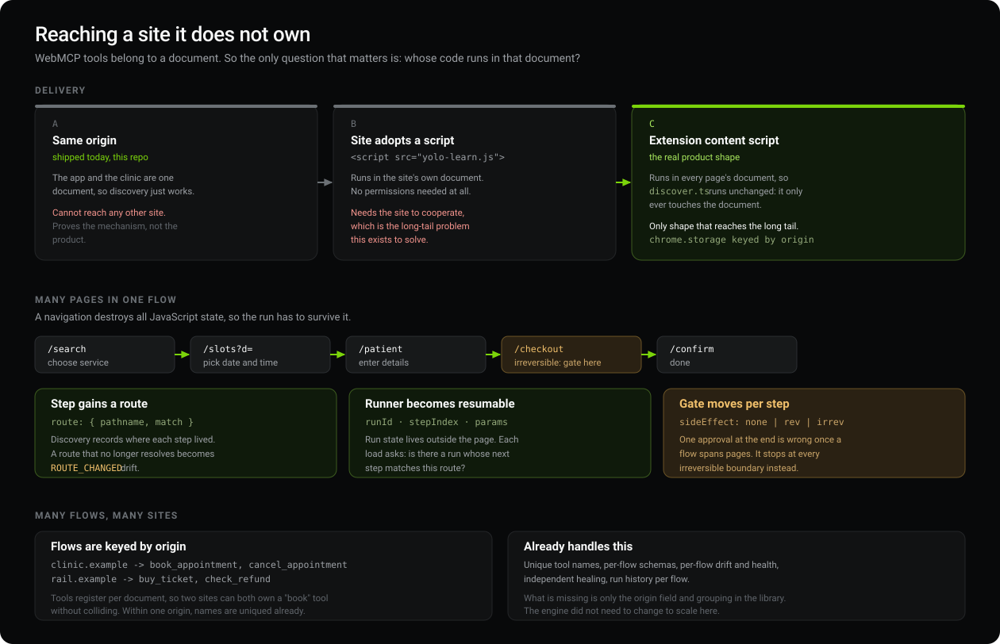
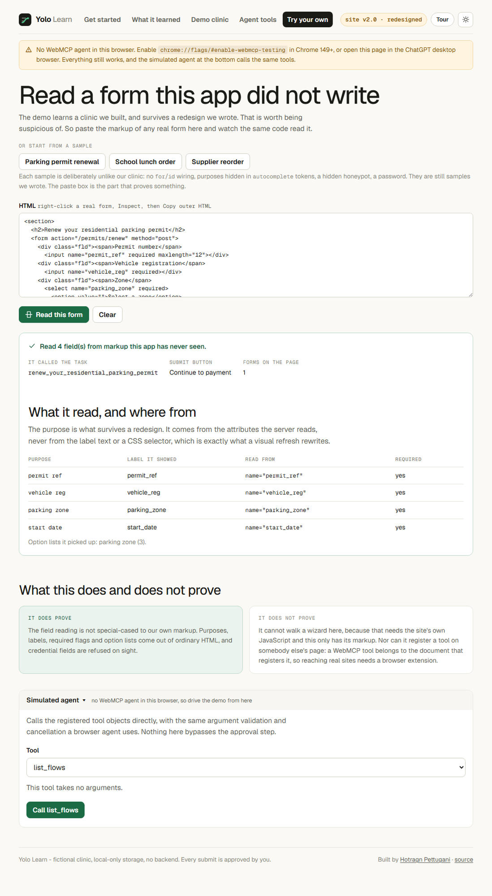

<p align="center">
  
</p>

<h1 align="center">Yolo Learn</h1>

<p align="center">
  <strong>It learns a website by itself, mints a WebMCP tool live, and heals when the site changes.</strong>
</p>

<p align="center">
  <a href="https://yolo-learn.vercel.app"></a>
  
  
  
  
</p>

<p align="center">
  <a href="https://yolo-learn.vercel.app"><strong>Open the live demo</strong></a> ·
  <a href="#architecture">Architecture</a> ·
  <a href="#recall-the-whole-thing-is-a-cache">The cache</a> ·
  <a href="#reaching-a-site-it-does-not-own">Scaling to real sites</a> ·
  <a href="VERIFICATION.md">What was verified</a>
</p>

---

## Sixty seconds

<p align="center">
  
</p>

Nine beats, unedited, sped up about two and a half times. Every one is a real
tool call against real storage, which is why it stops twice and waits for the
approval dialog. Press **Run the guided demo** on the live site to watch it
yourself. ([higher quality mp4](docs/demo.mp4))

**Or skip straight to any beat**, no setup:

| Link | Lands you on |
| --- | --- |
| [`#/?demo=learned`](https://yolo-learn.vercel.app/#/?demo=learned) | a flow it has just read off the page |
| [`#/?demo=drifted`](https://yolo-learn.vercel.app/#/?demo=drifted) | **the payoff**: 4 changes detected, 1 question |
| [`#/?demo=healed`](https://yolo-learn.vercel.app/#/?demo=healed) | healed and matching the redesigned site |

Those links do not fake anything. They run the real learn and heal path and then
drop you at the result.

---

## Why this is hard

At a glance this looks like a form filler. It is worth thirty seconds on why it
is not, because every one of these is a place the obvious approach fails.

**Recording selectors is easy and useless.** That is Selenium, and it breaks the
first time somebody renames a class. The hard requirement is the opposite: store
a task so that renaming a field, reordering the steps and reworking a button
*carry no information at all*. That is why a field's identity comes from its
`name` attribute, which is what the server reads, and a step's identity comes
from its intent. Neither is something a redesign touches.

**Knowing what you do not know.** Anything can guess a value for `Insurance ID`.
Refusing to guess, asking exactly once, and then never asking again is a
constraint most demos quietly break in order to look smarter. A question
answered with an empty string stays open here, so no flow ever claims to be
healthy while being unrunnable.

**Walking a wizard you have never seen, without submitting it.** Discovery has
to press buttons on an unknown page and must never accidentally buy something.
It only advances through a button that clearly reads as *next*, or where a
`Step N of M` counter proves there is more to come. Everything else is treated
as terminal and left alone.

**Registering tools mid-session.** Almost every WebMCP demo hardcodes its tools
at page load. Minting one at runtime and having a live agent call it with no
reload is the actual new capability, and it is the part that took reading the
spec properly to get right.

---

## Recall: the whole thing is a cache

The clearest way to describe this is not "it heals". It is **a cache with
revalidation**, and every behaviour falls out of that:

| State | Means | What it costs |
| --- | --- | --- |
| **miss** | Nothing known for this origin | Read the page. `learn_site` |
| **hit** | Known, and the page still fingerprints the same | **Nothing.** No re-reading, no diffing, nothing to ask |
| **stale** | Known, but the page fingerprints differently | Revalidate. `heal_flow`, and at most one question |

The cache key is `(origin, structure fingerprint)`. The fingerprint is the
ETag: an FNV-1a digest of step order, intents, button labels, and each field's
purpose, type, requiredness and option list.

What it deliberately leaves out is **labels**. Renaming `Your name` to
`Full name (as on insurance card)` does not change the fingerprint, because a
rename is not a different task, it is drift the engine heals from the page
itself. Adding a required field, reordering steps or changing an option list
does change it.

```
recall_page  ->  { state: "miss",  nextStep: "learn_site" }
             ->  { state: "hit",   nextStep: "run it, nothing to re-read" }
             ->  { state: "stale", changes: [...], questions: [...] }
```

`recall_page` is the tool an agent should call **first** on any page, before
`learn_site`. Healing refreshes the fingerprint, so a healed flow goes straight
back to being a hit rather than staying permanently stale.

This is also what stops the obvious bug: before recall existed, visiting the
demo site twice would happily read it again and mint a duplicate flow.

---

## The loop, in ninety seconds



### 1. It reads the page

Press **Learn automatically**, or ask an agent to call `learn_site`. You fill in
nothing.

```
Learned "clinic_booking" by reading the page:
4 steps, 5 fields, no demonstration and no invented values.
notes: ["Stopped at step 4 of 4 without submitting."]
```

It walks the four-step booking wizard and mints a tool with a real JSON Schema,
enums and required fields included:

```json
{
  "serviceType": { "enum": ["checkup", "dental cleaning", "physical exam"] },
  "date":        { "description": "Date, formatted YYYY-MM-DD" },
  "time":        { "enum": ["9:00 AM", "10:00 AM", "..."] },
  "patientName": { "description": "Patient name" },
  "phone":       { "description": "Phone" },
  "required": ["serviceType", "date", "time", "patientName", "phone"]
}
```

Every field is **required** on purpose. It read the shape of the task and stored
no values, because it has no business inventing somebody's name. Teach it by
hand instead and those same parameters become optional, falling back to what you
demonstrated.



### 2. The agent runs it. You hold the submit button.



Every step animates on screen, then it stops. The dialog lists the exact values
and names the button it is about to press. Deny it, press <kbd>Esc</kbd>, or
navigate away, and nothing is sent.

### 3. The site gets redesigned. It heals.

Switch to `#/site?v=2`, the same clinic a year later.



| What the redesign did | What happens |
| --- | --- |
| `Your name` becomes `Full name (as on insurance card)` | heals itself |
| the date step moves ahead of the service step | heals itself |
| `Confirm booking` becomes `Book appointment` | heals itself |
| **a new required `Insurance ID` appears** | **one question, asked once** |

Answer it. Run again. Green.

---

## Architecture


| Module | Job |
| --- | --- |
| [`discover.ts`](src/discover.ts) | Reads a wizard out of the live DOM. **Never imports the site model.** |
| [`drift.ts`](src/drift.ts) | Deterministic drift detection and healing |
| [`learn.ts`](src/learn.ts) | Turns a discovery into a flow and a tool |
| [`webmcp.ts`](src/webmcp.ts) | The verified WebMCP layer |
| [`runner.ts`](src/runner.ts) | Resumable run state, the plan, untrusted arguments |
| [`recall.ts`](src/recall.ts) | The cache lookup: miss, hit or stale |
| [`store.ts`](src/store.ts) | The semantic map, in `localStorage` |
| [`guided.ts`](src/guided.ts) | The guided run and the seeded deep links |
| [`SiteApp.tsx`](src/SiteApp.tsx) | The demo clinic and the on-screen executor |

`discover.ts` importing the site model would make the whole claim a lie, so it
does not. It gets exactly what a screen reader would get.

---

## Reaching a site it does not own

This is the honest part, and the question a reviewer should ask first.

**WebMCP tools belong to a document.** The demo works because Yolo Learn *is*
the clinic: same origin, same document. That is a demo harness, not a product.
Getting onto a page you do not own is not a WebMCP problem, it is a delivery
problem, and there are exactly three answers.



The cross-origin parts of the spec (`exposedTo`, `getTools({fromOrigins})`,
`<iframe allow="tools">`) federate tools between **consenting** origins. They do
not let you read an arbitrary site, so they are not an answer to the long tail.
A content script is.

### Multi-page: the runner is resumable

A page navigation destroys all JavaScript state, including the promise the agent
is waiting on. Three things were built for that, and all three are in:

**1. Run state lives outside the document.** `runId`, `flowId`, `params`,
`stepIndex` and everything already filled go in `sessionStorage`: per tab,
because two tabs must not fight over one run, and gone with the tab, because a
run is not a document. The runner checkpoints after every step.

**2. The runner picks up where it stopped.** Proven the blunt way, by reloading
the browser mid-run:

```
before reload   stepIndex 3, 5 values filled, status "running"
  ... hard reload, every module-level variable destroyed ...
after  reload   same runId, stepIndex 3, same 5 values, back at the approval gate
```

The site shows a banner saying the run survived a teardown, and
`get_run_status` reports `resumedAfterTeardown: 1`.

**3. A step gains a route and a side effect.** Discovery records
`route: { path, hash }` per step, and a step that moves is reported as
`ROUTE_CHANGED` drift. It also classifies the button:
`sideEffect: none | reversible | irreversible`, derived from the label and
**conservative by default**, so anything that does not clearly read as
navigation is gated. The run stops at *every* irreversible step, not once at
the end, because by the time a multi-page flow reaches the end the earlier
steps have already committed.

### How an agent recovers

Its promise died with the page, so it cannot be told. It has to ask:

```
get_run_status  ->  { status: "awaiting_approval", step: 4, of: 4,
                      resumedAfterTeardown: 1,
                      message: 'waiting for you to approve "Confirm booking"' }
```

The outcome also lands in the flow's own run history, so `list_flows` works as
a fallback. A second run while one is in flight is refused with a clear
message rather than silently queued.

**What is honestly not proven:** the demo site is a single document with hash
routes, so no real navigation happens in it. What has been proven is the
property that actually matters, which is that a run survives its JavaScript
context being destroyed, and a full reload is the most severe version of that.
Pointing this at a genuinely multi-document checkout is untested.

### What multi-flow costs

Almost nothing, which is the useful finding. Tools register per document, so two
different clinics can both own a `book_appointment` tool without colliding, and
within one origin names are already uniqued. Per-flow schemas, drift, health,
healing and run history all exist. The only missing piece is an `origin` field
and grouping in the library.

---

## Edge cases

Honest status. **Handled** means it is implemented and tested. **Designed** means
the behaviour is specified above but not yet coded.

| Case | Status | Behaviour |
| --- | --- | --- |
| Revisit a page already known | Handled | Cache hit. Offers to run it, not to learn it again |
| Revisit a page that changed | Handled | Cache stale. Offers to heal it |
| Healed flow revisited | Handled | Back to a hit. Healing refreshes the fingerprint |
| Flow stored before origins existed | Handled | Treated as belonging here rather than orphaned |
| Flow learned on another origin | Handled | Ignored by recall on this one |
| Learn the same site twice | Handled | Second tool becomes `clinic_booking_2`, no `InvalidStateError` |
| Learn a layout never seen before | Handled | Verified on v2: 6 fields in the new order |
| Page has no form | Handled | Reported, not thrown |
| Page never advances | Handled | Walk ends with "the page stopped advancing" |
| Button is not a next button | Handled | Refused and reported. Never clicked |
| Login wall mid-flow | Handled | Credentials refused. Walk stops, tells you to sign in |
| Password or card field | Handled | Refused outright. Never read, never filled, never stored |
| Missing required parameter | Handled | Names the parameter to pass. Does not falsely claim drift |
| Empty answer to a question | Handled | Stays drifted, question re-asked |
| Flow deleted mid-run | Handled | Run completes, flow not resurrected |
| Reload mid-run | Handled | Clean reset, tools re-minted |
| Navigate away mid-approval | Handled | Settles as a denial, never hangs the agent |
| Agent aborts mid-run | Handled | Cancels between steps and inside every pause |
| Corrupt `localStorage` | Handled | Bad entries dropped rather than crashing |
| Hostile tool arguments | Handled | Coerced, length-capped, enum-checked, real-date-checked |
| Run interrupted by a page teardown | Handled | Resumes at the step it reached. Verified by reloading mid-run |
| Agent's promise lost to a navigation | Handled | `get_run_status` reports the run. Outcome also in flow history |
| Irreversible step mid-flow | Handled | Gated at every irreversible step, not once at the end |
| Unrecognised button wording | Handled | Classified irreversible, so it gets a gate |
| Second run while one is in flight | Handled | Refused with a message, not queued |
| Two tabs running at once | Handled | Run state is per tab, so they cannot collide |
| Site changes its URLs | Handled | `ROUTE_CHANGED` drift, auto-healable |
| A genuinely multi-document site | Designed | Mechanism is in and tested. Never pointed at a real one |
| SPA route change with no page load | Designed | Observe `pushState` and `popstate` |
| Options loaded asynchronously | Designed | Wait for the option list to settle before reading |
| Two layouts behind one URL (A/B test) | Designed | Store variants per step intent |
| CAPTCHA or bot check | Designed | Stop and hand to the human. Never solve one |
| Concurrent runs in several tabs | Designed | One active run per origin, held in the background |
| Server-side validation failure | Designed | Feed the site's own error text back as a question |

---

## "You broke your own site on purpose"

Fair. The clinic is ours and so is its redesign, so of course it survives. The
field reading is the part actually under question, so it is exposed against
markup this app has never seen: **[Try your own](https://yolo-learn.vercel.app/#/any)**.



Paste any real form's HTML and the same code reads it, then shows where every
purpose came from:

```
po ref          <- name="po_ref"
sku             <- name="sku"
quantity        <- name="quantity"
delivery speed  <- name="delivery_speed"
Refused 1 field: Card number
```

Purposes come from the attributes a server reads, never from label text or a
CSS selector, because those are exactly what a visual refresh rewrites.

**It found two real bugs the moment it saw foreign markup**, and both were in
the live path, not just the new one:

- A `display:none` honeypot was read as a genuine field. `isVisible` leaned on
  `getComputedStyle`, and a parsed document has no view to compute in, so the
  check silently passed.
- A wrapping `<label>` swallowed its control's text, so `Year group` came out as
  `Year group Choose Year 3Year 4Year 5`. Our clinic puts label text in a
  `<span>`, which is precisely why this never surfaced.

That is the argument for the feature in miniature: reading only our own markup
was hiding defects.

**What it does not prove.** It cannot walk a wizard from markup alone, because
that needs the site's own JavaScript. It cannot register a tool on somebody
else's page either: a WebMCP tool belongs to the document that registers it, so
reaching real sites needs a browser extension. Both limits are stated on the
page itself.

## Run it

```
npm install
npm run dev
```

| Route | What it is |
| --- | --- |
| `#/` | Get started |
| `#/flows` | Learned flows, health, run history |
| `#/site` | The demo clinic, v1 |
| `#/site?v=2` | The same clinic, one year later |
| `#/site?teach=1` | Teach mode, when you want your own values remembered |
| `#/tools` | The live WebMCP registry |
| `#/any` | Read a form this app did not write |
| `#/?demo=learned` | Seeded: just read off the page |
| `#/?demo=drifted` | Seeded: drift ready to read |
| `#/?demo=healed` | Seeded: healed and matching |

```
npm test          # 117 unit tests
npm run typecheck
npm run build
```

## Test it with a real agent

- **Chrome 149+**: enable `chrome://flags/#enable-webmcp-testing`, relaunch.
  **Confirmed working.** The banner turns green and reports
  `WebMCP detected on document.modelContext. 7 tool(s) registered with the browser.`
- **ChatGPT desktop app**: open the deployed URL in the in-app browser.

Then ask: *"Learn the site, then run the flow you just learned."*

**No WebMCP in your browser?** Nothing breaks. Every page still works, and the
**Simulated agent** panel at the bottom calls the same registered tool objects a
real agent calls, with the same argument validation, the same `AbortSignal` and
the same approval step. It exists so none of the claims here have to be taken on
faith.

### WebMCP notes worth knowing

Verified against the [spec](https://webmachinelearning.github.io/webmcp/) and
[Chrome's docs](https://developer.chrome.com/docs/ai/webmcp). Five things bite:

- The entry point is `document.modelContext`. An earlier revision of the proposal
  used `navigator.modelContext`, so both are feature-detected.
- `registerTool()` returns a **Promise** and **rejects with `InvalidStateError`**
  if the name is taken. Flow names are made unique before they are offered.
- Tools are removed by aborting the `AbortSignal` passed to `registerTool`, not
  by an `unregisterTool` method.
- **WebMCP is refused in documents that are not origin-keyed.** This app ships
  `Origin-Agent-Cluster: ?1` (`vite.config.ts` for dev, `vercel.json` for
  production). Without that header, registration fails with `SecurityError`. The
  banner at the top of the app tells you if that ever happens.
- **Access is gated by permissions policy, not by a consent prompt.** The
  `tools` policy-controlled feature defaults to `self`, and a document that is
  not allowed to use it gets `NotAllowedError`. Top-level same-origin satisfies
  the default; an embedded build would need `<iframe allow="tools">`. The spec
  does **not** mandate a user-facing permission dialog, which is precisely why
  the approval step in this app is our own.

Declarative attributes used on the booking form: `toolname`, `tooldescription`,
`toolparamdescription`. `toolautosubmit` is deliberately **not** used, because
the human owns the submit.

## The tools an agent sees

| Tool | What it does |
| --- | --- |
| `recall_page` | **Do I already know this page?** miss, hit or stale. Call this first |
| `learn_site` | **Learn this page autonomously.** No demonstration |
| `list_flows` | What is known, with health and parameters |
| `check_flow_health` | Plain-English drift report and any questions |
| `run_flow` | Run a flow. The human approves the submit |
| `heal_flow` | Apply answers and re-read the site |
| `get_run_status` | **Recover a run** whose promise a navigation destroyed |
| `get_site_info` | Current site version and changelog |
| `start_teaching` | Teach mode, for when you want your own values kept |
| *`<flow name>`* | Minted per learned flow, schema built from what it found |

Read-only tools carry `readOnlyHint`. Anything echoing stored user content
carries `untrustedContentHint`.

## What it will not do

- **Submit without you.** Every run stops at an approval dialog listing the exact
  values.
- **Press a button it does not understand.** Only *next*, *continue* or
  *proceed*, or where a step counter proves there is more to come.
- **Touch a password or a card.** Credential and payment fields are refused while
  learning. A step that is nothing but a sign-in wall ends the walk.
- **Invent your details.** It stores the shape of a task, not values. The
  throwaway values it types to walk a wizard go in the audit trail and are
  discarded.
- **Trust its input.** Arguments are coerced, length-capped, checked against the
  live option lists, and dates must be real calendar dates.
- **Send your data anywhere.** Single origin, `localStorage` only. No backend, no
  accounts, no telemetry. The clinic is fictional and no booking is real.

## How it is built

Vite, React and TypeScript. Plain CSS with custom properties, no UI framework,
no state library, and no icon dependency: the icon set is hand-written SVG in
[`src/icons.tsx`](src/icons.tsx), one glyph per beat of the product story. Type
is self-hosted Geist. Dark mode follows `prefers-color-scheme` with a manual
override.

[`VERIFICATION.md`](VERIFICATION.md) records what was tested and how, every edge
case result, the deviations from the original brief with reasons, and explicitly
what is **not** verified.

---

<p align="center">
  Built by <a href="https://github.com/Hotragn">Hotragn Pettugani</a> ·
  <a href="https://hotragnpettugani.design">hotragnpettugani.design</a> ·
  MIT licensed
</p>
